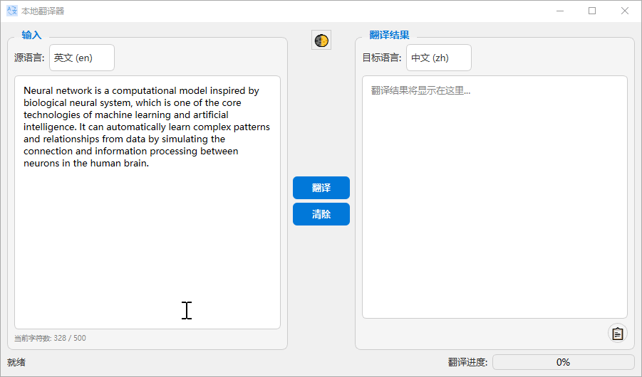

# LocalTranslator

<div align="center">
  
  <h4>
    <a href="README.md">🇨🇳 中文</a>
    <span> | </span>
    <a href="README_EN.md">🇬🇧 English</a>
  </h4>
</div>

## ✨ Features

- 🤖 **AI-Powered Translation**: Based on T5 transformer model for high-quality translation
- 🌐 **Multi-Language Support**: Supports Chinese, English, and Russian translation
- 💻 **Offline Operation**: Works completely offline, no internet connection required
- 🎨 **Modern UI**: Clean and intuitive interface with dark/light theme support
- ⚡ **Real-time Character Count**: Shows character count with visual warnings
- 📝 **Smart Input Limits**: Automatic text length management for optimal performance



## 🚀 Quick Start

### Installation

#### Option 1: Download Pre-built Executable
1. Download the latest release from [Releases](https://github.com/zstar1003/LocalTranslator/releases)
2. Run the installer and follow the setup wizard
3. Launch LocalTranslator from desktop or start menu

#### Option 2: Run from Source
1. Clone the repository:
   ```bash
   git clone https://github.com/zstar1003/LocalTranslator.git
   cd LocalTranslator
   ```

2. Install dependencies:
   ```bash
   uv sync
   ```

3. Download the AI model:
   ```bash
   python download_models.py
   ```

4. Run the application:
   ```bash
   python main.py
   ```

## 📖 Usage

1. **Select Source Language**: Choose the language of your input text
2. **Select Target Language**: Choose the language you want to translate to
3. **Enter Text**: Type or paste your text in the input area
4. **Monitor Character Count**: Keep an eye on the character counter (500 character limit)
5. **Translate**: Click the "Translate" button to get your translation
6. **Copy Result**: Use the copy button to copy the translation to clipboard

### Supported Language Pairs

- Chinese ↔ English
- Chinese ↔ Russian  
- English ↔ Russian

## 🛠️ Building from Source

### Build Executable

1. Install build dependencies:
   ```bash
   pip install -r requirements-build.txt
   ```

2. Run the build script:
   ```bash
   package_all.bat
   ```

3. The executable will be created in the `dist/` directory

### Create Installer

1. Install [NSIS](https://nsis.sourceforge.io/Download)
2. Add NSIS to your PATH environment variable
3. Run the installer creation script:
   ```bash
   create_installer.bat
   ```

## 🎨 Interface

### Main Features
- **Input Panel**: Text input area with real-time character counting
- **Output Panel**: Translation results with copy functionality
- **Language Selection**: Dropdown menus for source and target languages
- **Theme Toggle**: Switch between light and dark themes
- **Progress Indicator**: Shows translation progress

### Character Limit System
- **Green (0-400 chars)**: Normal operation
- **Orange (400-500 chars)**: Approaching limit
- **Red (500+ chars)**: Exceeds limit, will be truncated

## 🔧 Technical Details

### Architecture
- **Frontend**: PyQt6 for cross-platform GUI
- **Backend**: Transformers library with T5 model
- **Model**: `utrobinmv/t5_translate_en_ru_zh_small_1024`
- **Threading**: Asynchronous translation to prevent UI freezing

### Performance
- **Model Size**: ~1GB
- **Memory Usage**: 2-4GB during operation
- **Translation Speed**: 1-3 seconds for typical text
- **Supported Text Length**: Up to 500 characters per translation

## 📁 Project Structure

```
LocalTranslator/
├── main.py                 # Application entry point
├── translator/             # Main application package
│   ├── translator_app.py   # Main GUI application
│   ├── translation_thread.py # Translation worker thread
│   ├── config.py          # Configuration constants
│   └── themes.py          # UI theme definitions
├── ui/                    # UI resources
│   └── logo.png          # Application logo
├── models/               # AI model files
├── build.spec           # PyInstaller build configuration
└── installer.nsi       # NSIS installer script
```

## 🙏 Acknowledgments

- [Hugging Face Transformers](https://huggingface.co/transformers/) for the ML framework
- [PyQt6](https://www.riverbankcomputing.com/software/pyqt/) for the GUI framework
- [T5 Model](https://huggingface.co/utrobinmv/t5_translate_en_ru_zh_small_1024) for translation capabilities

## 📞 Support

If you encounter any issues or have questions:

1. Check the [Issues](https://github.com/zstar1003/LocalTranslator/issues) page
2. Create a new issue if your problem isn't already reported
3. Provide detailed information about your system and the issue

---

